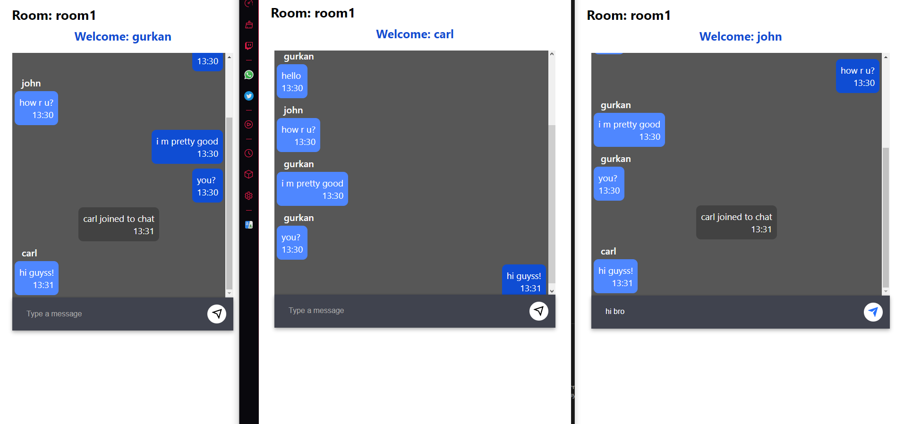

# Socket io chat example backend and frontend

##Tech Stack

**Spring Boot**

**React**

**SocketIO**

**H2 db**

## Example Images




### Example Video:

[https://www.youtube.com/watch?v=y7jnF7MuNLI](https://www.youtube.com/watch?v=y7jnF7MuNLI)


## BACKEND

**Spring Boot**

**Netty Socket IO:** socket server

**H2 db:** socket server


### How to run

#### clone the project: https://github.com/gurkanucar/socketio-simple-chat

```bash
  git clone https://github.com/gurkanucar/socketio-simple-chat
```

#### run

```bash
  cd backend
  
  mvn spring-boot:run
```

### Note that!
#### You have to configure ip and port details from "application.properties" file.

socket-server.host=192.168.0.10 // write your ip address not local host


## FRONTEND


### Used Packages

**SocketIO:** socket io client (must be version 2)

**React icons**: icon package


### How to run

#### clone the project: https://github.com/gurkanucar/socketio-simple-chat

```bash
  git clone https://github.com/gurkanucar/socketio-simple-chat
  cd socketio-simple-chat
  cd frontend
```

#### install packages

```bash
  npm install
```

#### run app

```bash
  npm start
```

### Note that!
#### You have to configure ip and port details from "apiConstants" file.

export const SOCKET_BASE_URL = "http://192.168.0.10:8085"; // write your ip address not local host

export const API_BASE_URL = "http://192.168.0.10:8080"; // write your ip address not local host


